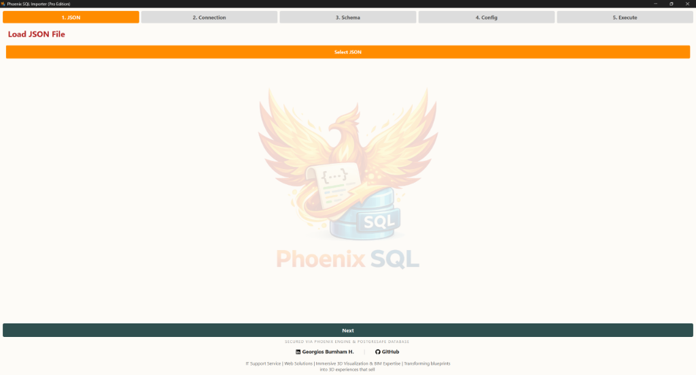

# 🦅 Phoenix SQL Importer

> **Transforming JSON chaos into PostgreSQL precision**

Phoenix SQL Importer is a professional-grade desktop application that automates the synchronization of JSON data files with PostgreSQL databases. Built with PyQt6, it provides a guided 5-step wizard for intelligent data mapping, schema evolution, and flexible import strategies.

---

## 📸 Interface



*The Phoenix SQL Importer v5.0 interface showing the complete workflow from JSON selection to database execution.*

---

## ✨ Key Features

### 🎯 Core Capabilities
- **JSON to PostgreSQL Mapping**: Automatic field detection and SQL type inference
- **Schema Intelligence**: Dynamic ALTER TABLE support for new columns
- **JSONB Support**: Native handling of nested JSON structures
- **3 Import Modes**:
  - 🔄 **UPSERT**: Update existing records or insert new ones (safe, recommended)
  - 💥 **NUKE**: Drop and recreate table (destructive, clean slate)
  - ➕ **APPEND**: Add records to existing table

### 🛠️ Advanced Functionality
- **Standalone SQL Export**: Generate executable SQL scripts without database connection
- **Duplicate Prevention**: Strict Primary Key validation before import
- **Visual Schema Mapping**: Interactive table for field selection and type configuration
- **Real-time Logging**: Integrated debug logging with `phoenix_debug.log`
- **Connection Validation**: Robust pre-flight checks (Host, Port, DB, User)
- **Portable Edition**: Single `.exe` deployment (no installation required)

---

## 🚀 Installation

### Prerequisites
- Python 3.8+
- PostgreSQL 12+ (for direct import)

### Setup

1. **Clone the repository**
   ```bash
   git clone https://github.com/burnham/Phoenix-JSON2SQL-Master.git
   cd Phoenix-JSON2SQL-Master
   ```

2. **Install dependencies**
   ```bash
   pip install pandas sqlalchemy psycopg2-binary PyQt6
   ```

3. **Run the application**
   ```bash
   python phoenix_gui.py
   ```

### Optional: Build executable
For a standalone `.exe` (Windows):
```bash
build_gui_exe.bat
```

---

## 📖 Usage

### Step 1: Select JSON File
Load your JSON data file containing an array of objects:
```json
[
  {"id": 1, "name": "Product A", "price": 29.99},
  {"id": 2, "name": "Product B", "price": 49.99}
]
```

### Step 2: Database Connection
Configure your PostgreSQL connection:
- **Host**: `localhost` or your server IP
- **Port**: `5432` (default)
- **Database**: Your target database name
- **User**: PostgreSQL username
- **Password**: (optional, depending on your setup)

Click **Test Connection** to verify before proceeding.

### Step 3: Schema Mapping
- ✅ Select which fields to include
- 🔧 Choose SQL data types (VARCHAR, TEXT, JSONB, INTEGER, etc.)
- 🔑 Mark your Primary Key field (e.g., `id`, `sku`)

### Step 4: Configuration
- **Table Name**: Target table in PostgreSQL
- **Mode**: Choose UPSERT, NUKE, or APPEND

### Step 5: Execute
Monitor the import process in real-time with detailed console output.

---

## 🎨 Project Evolution

This project evolved through multiple iterations:

- **v1.0** - Initial Core: Basic JSON mapping and GUI framework
- **v1.1** - Data Integrity: Duplicate PK checking
- **v1.5** - Schema Evolution: Dynamic ALTER TABLE support
- **v2.x** - Professional Branding & Stability
- **v3.0** - SQL Export Engine: Connection-less export mode
- **v4.x** - UX Evolution: Modern UI polish and watermarking
- **v5.0** - Stable Release: Production-ready state

See full history: [Commits](https://github.com/burnham/Phoenix-JSON2SQL-Master/commits/master)

---

## 🛡️ Technical Stack

- **Frontend**: PyQt6 (Cross-platform GUI)
- **Backend**: SQLAlchemy + psycopg2
- **Data Processing**: Pandas
- **Database**: PostgreSQL with JSONB support
- **Logging**: Python logging module

---

## 📂 Project Structure

```
Phoenix-JSON2SQL-Master/
│
├── phoenix_gui.py          # Main GUI application
├── phoenix_importer.py     # Core import/export engine
├── logger_config.py        # Centralized debug logging system
├── sanitize.py             # Security sanitization tool
├── resources/              # UI icons and branding
│   ├── phoenix_icon.ico
│   ├── phoenix_center.png
│   ├── github_icon.png
│   └── linkedin_icon.png
│
├── build_gui_exe.bat       # Executable builder (Windows)
├── limpiar_gui.bat         # Cleanup script
└── README.md               # This file
```

---

## 👤 Author

**Georgios Burnham H.**  
*IT Support Service | Web Solutions | Immersive 3D Visualization & BIM Expertise*

[](https://www.linkedin.com/in/gobh/)
[](https://github.com/burnham)

---

## 🙏 Acknowledgments

This project was inspired by the teachings of **Jorge Benitez** from [NACAI.COM](https://nacai.com), whose guidance in database architecture and automation sparked the vision for Phoenix SQL Importer.

*Interface and engine architecture powered by Anya-Corena Development Framework.*

---

## 📜 License

This project is developed for professional portfolio purposes.

---

**Built with ❤️ for data engineers who value precision.**
